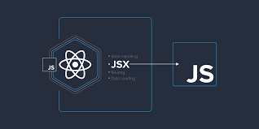

# Lecture1-May.react
# Homework
## _`What is React?`_

### `React` is an open source JavaScript library for devloping user interfaces. React can be used to develop single page and mobile application .

## _`Why we learn React ?`_
### `React` saves you time and money on\development because it's componentbased. You can break down an interfaceinto reusable components that allow you to build dynamic user interfaces. This taps into the current thinking behind 'Design Systems'
.


## _`Popular websites created by React`_


----------------------------------------------------------------------------
## _`What is NodeJs ?`_

### NODE.JS IS A SERVER-SIDE PLATFORM BUILT ON GOOGLE CHROME'S JAVASCRIPT ENGINE (V8 ENGINE). NODE.JS WAS DEVELOPED BY RYAN DAHL IN 2009.


## _`What is NPM ?`_

### npm is the default package manager for the JavaScript runtime environment Node.js.


## _`CREATE VITE APP`_
## _`CREATE REACT APP`_

### VITE AND CREATE REACT APP ARE NOT AS DIFFERENT AS YOU MIGHT THINK. THE MAJOR DIFFERENCE LIES IN HOW CODE IS SERVED IN DEVELOPMENT AND WHICH MODULES ARE SUPPORTED.


## _`CREATE REACT APP`_
-  CREATE A NEW FOLDER WITH NAME OF REACT APPLICATIONS IN DOCUMENTS
-  OPEN DIRECTORY IN VISUAL STUDIO TERMINAL
-  TYPE BELOW COMMAND
```
npx create-react-app my-app
cd my-app
npm start
```

## _`VITE REACT`_
### Vite (French word for "quick", pronounced /vit/, like "veet") is a build tool that aims to provide a faster and leaner development experience for modern web projects. It was created by Evan You, the creator of Vue.js, and it's designed to be fast, simple, and highly configurable.


## _`HOW VITE WORKS?`_

### When you run the dev server, it starts a lightweight web server thatserves your files directly to thebrowser without bundling them first. This means that changes are reflected immediately in the browser without having to wait for a rebuild. 


## _`WHAT IS DOM?`_

### The Document Object Model (DOM) is a programming interface for web documents. It represents the page so that programs can change the document structure, style, and content.


## _`WHAT IS VIRTUAL DOM?`_

### A virtual DOM object is a representation of a DOM object, like a lightweight copy


## _`JSX`_

### JSX allows us to write HTML elements in JavaScript and place them in the DOM without any createElement() and/or appendChild() methods. JSX converts HTML tags into react elements. You are not required to use JSX, but JSX makes it easier to write React applications.


